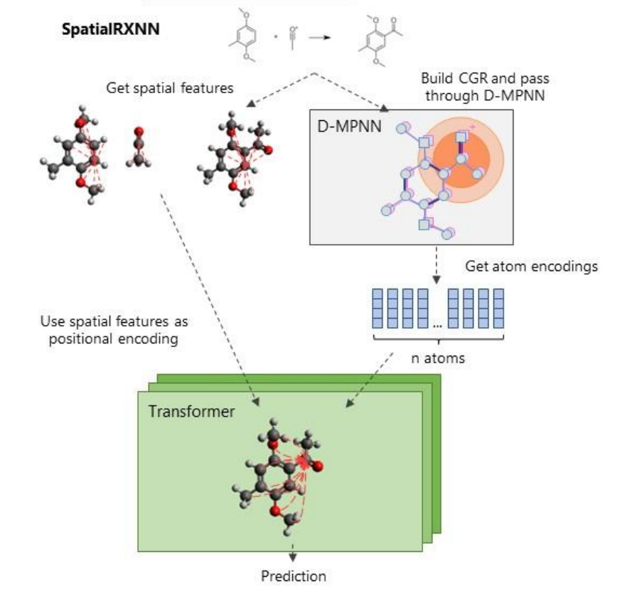

# SpatialRXNN

**Spatial-aware deep learning for chemical reaction property prediction**

SpatialRXNN is a 2023 research prototype that combines a condensed graph of reaction (CGR), a directed message-passing neural network (D-MPNN), and a transformer with learned 3D spatial encodings. It was developed to predict activation energies, reaction enthalpies, and reaction rate constants while retaining chemically meaningful graph structure.

**Technologies:** Python, PyTorch, PyTorch Geometric, RDKit, graph neural networks, transformers, molecular representation learning

*SpatialRXNN combines local chemical representations from a D-MPNN with global, distance-aware atom interactions in a transformer.*

## Key contributions

My work focused on the reaction-specific architecture and experimental pipeline:

- Built an RDKit preprocessing pipeline for conformer generation and 3D reactant-to-product distance-change matrices.
- Modified Chemprop's CGR/D-MPNN architecture to expose variable-length atom-level embeddings.
- Designed a transformer readout with learned Gaussian 3D encodings and per-head spatial attention biases.
- Developed a staged pretraining and fine-tuning workflow and evaluated the model across four reaction-property datasets.

A file-by-file breakdown is available in [Implementation and contribution map](docs/implementation.md).

## Architecture

For an atom-mapped reaction, SpatialRXNN performs four main operations:

1. **Build a condensed graph of reaction.** Reactant and product atoms are superposed using atom mapping. Atom and bond features contain the reactant representation and the corresponding reaction-induced change.
2. **Encode local structure.** A D-MPNN propagates messages along directed bonds and produces one learned representation per atom.
3. **Encode spatial change.** RDKit conformers provide pairwise atomic distances. Product-minus-reactant distance changes are projected through learnable Gaussian kernels.
4. **Model global interactions.** A transformer processes the atom representations. Spatial features contribute both an absolute encoding and a per-head attention bias. A virtual `[CLS]` representation is used for the final prediction.

The full architecture, equations, experimental protocol, and ablations are described in the [project report](docs/SpatialRXNN_Report.pdf).

## Results

The table below reproduces the mean absolute error reported in the 2023 project report. Values are mean +/- standard deviation; lower is better.

| Model | Ea omegaB97X-D3 (kcal/mol) | Ea E2/SN2 (kcal/mol) | Delta H Rad-6-RE (eV) | log(k) (unitless) |
| --- | ---: | ---: | ---: | ---: |
| CGR, default | 4.84 +/- 0.29 | 2.64 +/- 0.10 | 0.16 +/- 0.01 | 0.66 +/- 0.29 |
| CGR, optimized | 4.25 +/- 0.19 | 2.65 +/- 0.09 | **0.13 +/- 0.01** | 0.66 +/- 0.24 |
| **SpatialRXNN** | **2.68 +/- 0.61** | **2.53 +/- 0.11** | 0.14 +/- 0.02 | **0.33 +/- 0.08** |

In the original comparison, SpatialRXNN improved the reported activation-energy and reaction-rate results, while providing little improvement for reaction enthalpy. The report argues that enthalpy is more directly determined by local bond changes, making global spatial interactions less useful for that task.

Results shown are from the original 2023 project evaluation. Full experimental details, ablations, and additional baselines are available in the [project report](docs/SpatialRXNN_Report.pdf).

## Implementation

| Path | Purpose |
| --- | --- |
| [`chemprop/features/featurization.py`](chemprop/features/featurization.py) | CGR construction and spatial distance-change features |
| [`chemprop/models/mpn.py`](chemprop/models/mpn.py) | D-MPNN atom-level representations |
| [`chemprop/models/transformer.py`](chemprop/models/transformer.py) | Spatially biased transformer and Gaussian basis layer |
| [`chemprop/models/model.py`](chemprop/models/model.py) | SpatialRXNN model composition and readout |
| [`ex_script_get_3d_features.py`](ex_script_get_3d_features.py) | Historical conformer-generation script |
| [`ex_script_grambow.py`](ex_script_grambow.py) | Historical staged training script for B97-D3/omegaB97X-D3 |
| [`docs/implementation.md`](docs/implementation.md) | Detailed contribution map and data flow |
| [`docs/SpatialRXNN_Report.pdf`](docs/SpatialRXNN_Report.pdf) | Full project report, experimental setup, and analysis |

## Background and attribution

SpatialRXNN is based on [Chemprop](https://github.com/chemprop/chemprop), originally developed by Yang et al. for molecular property prediction and extended by Heid and Green for condensed reaction graphs. This repository includes a modified snapshot of Chemprop v1.5.2 under its MIT license.

The project draws particularly on:

- K. Yang et al., *Analyzing Learned Molecular Representations for Property Prediction* (2019).
- E. Heid and W. H. Green, *Machine Learning of Reaction Properties via Learned Representations of the Condensed Graph of Reaction* (2021).
- C. Ying et al., *Do Transformers Really Perform Bad for Graph Representation?* (2021).

The full bibliography is included in the [report](docs/SpatialRXNN_Report.pdf).

## Author

**Evan HJ Lim**

SpatialRXNN was developed as an academic machine-learning project in 2022-2023.

## License

The inherited Chemprop code and this repository are distributed under the MIT License. See [LICENSE.txt](LICENSE.txt).
